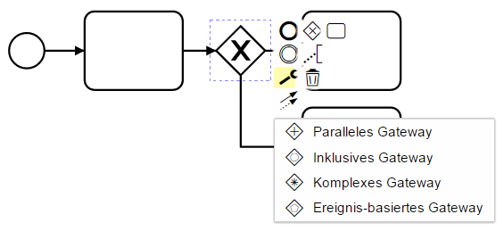

# bpmn-js i18n Example

This example shows how to easily translate the strings displayed in [bpmn-js](https://github.com/bpmn-io/bpmn-js) to another language.



## Usage Summary

The custom translation function is provided as an additional module when [bpmn-js](https://github.com/bpmn-io/bpmn-js) is instantiated. The default translation implementation is thereby overwritten.

```
var customTranslate = {
  translate: [ 'value', require('./custom-translate/custom-translate') ]
};

var modeler = new BpmnModeler({
  // ...
  additionalModules: [
    customTranslate
  ]
});
```

You can use your own implementation for translation. The function has two arguments (a template string and an optional object with replacements) and must return the translated string. The example provides two main functionalities: translating and replacing template strings.

Translating a string:

```
var translations = {
  'Append': 'Anhängen'
};

//...

translate('Append'); // Returns 'Anhängen'
```

Translating a template string:

```
var translations = {
  'Append {element}': '{element} anhängen'
};

//...

translate('Append {element}', {element: 'Gateway'}); // Returns 'Gateway anhängen'
```

A list of all available template strings of [bpmn-js](https://github.com/bpmn-io/bpmn-js) can be found [here](app/customTranslate/translationsGerman.js).

## Building the Project

You need a [NodeJS](http://nodejs.org) development stack with [npm](https://npmjs.org) and [grunt](http://gruntjs.com) installed to build the project.

To install all project dependencies execute

```
npm install
```

Build the application (including [bpmn-js](https://github.com/bpmn-io/bpmn-js)) using [browserify](http://browserify.org) via

```
grunt
```

You may also spawn a development setup by executing

```
grunt auto-build
```

Both tasks generate the distribution ready client-side modeler application with internationalization into the `dist` folder.

Serve the application locally or via a web server (nginx, apache, embedded).
