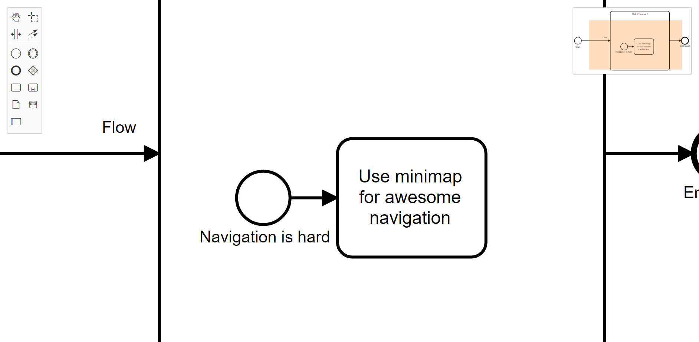

# bpmn-js Minimap Example

This example uses [bpmn-js](https://github.com/bpmn-io/bpmn-js) and [diagram-js-minimap](https://github.com/bpmn-io/diagram-js-minimap). It implements a BPMN 2.0 modeler with a minimap that lets you navigate the diagram.



## Usage

Add [diagram-js-minimap](https://github.com/bpmn-io/diagram-js-minimap) to your project:

```
npm install --save diagram-js-minimap
```

Now extend the [bpmn-js](https://github.com/bpmm-io/bpmn-js) modeler with the transaction boundaries module (cf. [`app/index.js`](app/index.js#L14) for details).

```javascript

var BpmnModeler = require('bpmn-js/lib/Modeler');

var minimapModule = require('diagram-js-minimap');

var canvas = $('#js-canvas');

var bpmnModeler = new BpmnModeler({
  container: canvas,
  additionalModules: [
    minimapModule
  ]
});

bpmnModeler.importXML(xml, function(err) {

  if (err) {
      console.error(err);
    } else {
      console.log('Awesome! Ready to navigate!');
    }
  });

```


## Building the Example

You need a [NodeJS](http://nodejs.org) development stack with [npm](https://npmjs.org) and [grunt](http://gruntjs.com) installed to build the project.

To install all project dependencies execute

```
npm install
```

Build the example using [browserify](http://browserify.org) via

```
grunt
```

You may also spawn a development setup by executing

```
grunt auto-build
```

Both tasks generate the distribution ready client-side modeler application into the `dist` folder.

Serve the application locally or via a web server (nginx, apache, embedded).
